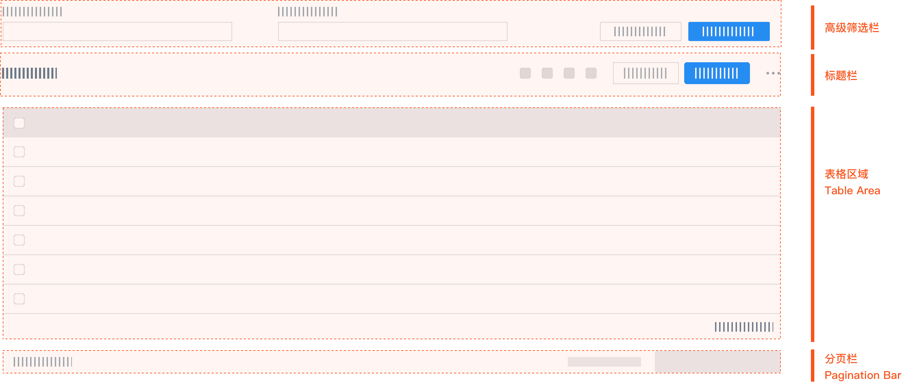

# ProTable

ProTable 的诞生是为了解决项目中需要写很多 table 的样板代码的问题，所以在其中封装了很多常用的逻辑。这些封装可以简单的分类为预设行为与预设逻辑。


<span>图片来源 [Antd ProTable](https://procomponents.ant.design/components/table)</span>

## 基础用法

<script setup>
import ProTableBasic from '../../examples/views/pro-table/basic/index.vue'
import demoSource from '../../examples/views/pro-table/basic/index.vue?raw'
</script>

<ClientOnly>
  <DemoBlock :code="demoSource">
    <ProTableBasic />
  </DemoBlock>
</ClientOnly>

## API
ProTable 在 el-form 和 el-table 上进行了一层封装，支持了一些预设。这里只列出与 el-table 不同的 API。

### ProTable Attributes

| 参数 | 说明 | 类型 | 默认值 |
| --- | --- | --- | --- |
| search | 搜索表单，传入对象时为搜索表单的配置 | `boolean \| SearchConfig` | `true` |
| className | `el-table` 类名 | `string` | — |
| dataSource | 表格数据 | `DefaultRow[]` | — |
| loading | 加载状态 | `boolean` | — |
| total | 总条数 | `number` | — |
| tableProps | `el-table` 属性 | [TableProps](https://element-plus.org/zh-CN/component/table.html#table-attributes) | — |
| tableEvents | `el-table` 事件 | [TableEmits](https://element-plus.org/en-US/component/table#table-events) | — |
| columns | 列定义 | `ColumnsConfig[]` | — |
| paginationProps | `el-pagination` 属性 | [PaginationProps](https://element-plus.org/zh-CN/component/pagination.html#attributes) | — |
| paginationMapping | 分页字段映射 | `{ pageKey?: string; sizeKey?: string }` | `pageNum` / `pageSize` |
| initialValues | 表单默认值 | `Record<string, any>` | — |
| defaultSize | 默认组件尺寸 | `'' \| 'large' \| 'default' \| 'small'` | — |
| manualRequest | 是否需要手动触发首次请求。配置为 true 时不可隐藏搜索表单 | `boolean` | `false` |
| columnSettings | 列设置 | `boolean \| ColumnSettings` | `true` |


```ts
type DefaultRow = Record<string | number | symbol, any>
```

### ProTable Events

| 事件名 | 说明 | 类型 |
| --- | --- | --- |
| onParams | 查询、重置、分页、排序时触发 | `(params: Record<string, any>) => void` |
| onSubmit | 点击查询时触发 | `(params: Record<string, any>) => void` |
| onReset | 点击重置时触发 | `() => void` |
| onCollapse | 搜索表单展开/收起 | `(collapsed: boolean) => void` |

### ProTable Methods

| 方法名 | 说明 | 类型 |
| --- | --- | --- |
| setFieldsValue | 批量设置搜索字段 | `(data: Record<string, any>) => void` |
| setFieldValue | 设置单个搜索字段 | `(key: string, value: any) => void` |
| reload | 刷新，接收一个参数：是否重置页码，<code>resetPageIndex</code> 默认 <code>true</code> | `(resetPageIndex?: boolean) => void` |
| getTableRef | 获取 `el-table` ref | `() => Ref<TableInstance \| undefined>` |

### 默认插槽

| 名称 | 描述 |
| --- | --- |
| default | 高级筛选栏与表格之间的区域 |

### searchConfig

| 参数 | 说明 | 类型 | 默认值 |
| --- | --- | --- | --- |
| searchText | 查询按钮文本 | `string` | `查询` |
| resetText | 重置按钮文本 | `string` | `重置` |
| labelWidth | 标签宽度 | `string \| number` | — |
| labelPosition | 标签位置 | `'left' \| 'right'` | — |
| rowProps | `el-row` 属性 | [RowProps](https://element-plus.org/zh-CN/component/layout.html#row-attributes) | `{ gutter: 8 }` |
| colProps | `el-col` 属性 | [ColProps](https://element-plus.org/zh-CN/component/layout.html#col-attributes) | `defaultColConfig` |
| className | 搜索区 `el-form` 类名 | `string` | — |
| defaultCollapsed | 默认是否收起 | `boolean` | `true` |
| collapsed | 受控收起状态 | `boolean` | — |
| defaultExpandedRows | 默认展开行数 | `number` | `2` |

### defaultColConfig
```ts
const defaultColConfig = {
  xs: 24, // <768px
  sm: 24, // >=768px
  md: 12, // >=992px
  lg: 8,  // ≥1200px
  xl: 6,  // ≥1920px
}
```

### defaultPaginationProps
```json
{
  "page-sizes": [10, 20, 30, 50],
  layout: "total, sizes, prev, pager, next, jumper",
  "hide-on-single-page": true,
}
```

### paginationMapping

| 参数 | 说明 | 类型 | 默认值 |
| --- | --- | --- | --- |
| pageKey | 页码字段名 | `string` | `pageNum` |
| sizeKey | 每页条数字段名 | `string` | `pageSize` |

> 通过 `extends`，可以全局配置这两个字段，参考下方示例代码。

```ts
// pro-table.ts
import { defineComponent } from 'vue'
import { ProTable as ElProTable } from '@rasmusxiong/element-plus-pro-components'

export const ProTable = defineComponent({
  name: 'ProTable',
  extends: ElProTable,
  props: {
    paginationMapping: {
      type: Object,
      default: () => ({
        pageKey: 'page',
        sizeKey: 'size',
      }),
    },
  },
})
```

### columnSettingsConfig

| 参数 | 说明 | 类型 | 默认值 |
| --- | --- | --- | --- |
| columnSetting | 列设置按钮文本 | `string` | 列设置 |
| columnDisplay | 列展示标题 | `string` | 列展示 |
| resetText | 重置按钮文本 | `string` | 重置 |
| draggable | 是否可拖拽排序 | `boolean` | `true` |
| checkable | 是否可显示/隐藏列 | `boolean` | `true` |

> 列设置标题取 `columns.label`；显示/隐藏取 `columns.prop || columns.key`；排除 `columns.type` 列。

### columnsConfig

继承 `el-table-column` 属性，并扩展（详见 [Schema 说明](/guide/schema)）：

| 参数 | 说明 | 类型 | 默认值 |
| --- | --- | --- | --- |
| formItemProps | 搜索区 `el-form-item` 配置 | [FormItemProps](https://element-plus.org/zh-CN/component/form.html#form-item-attributes) | — |
| renderLabel | 搜索区自定义 label | `() => VNode` | — |
| valueType | 搜索表单元素类型 | 见 [valueType](/guide/schema#valuetype) | — |
| renderField | 自定义搜索表单项 | `({ form, formItem }: { form: any, formItem: ProFormItemProps }) => VNode` | — |
| fieldProps | 搜索表单元素 props | `Record<string, any>` | — |
| fieldEvents | 搜索表单元素 events | `Record<string, any>` | — |
| valueEnum | 表格单元格枚举展示 | `Record<string \| number, string> \| Map<...>` | — |
| optionLoader | 异步加载搜索选项 | `() => Promise<Record<string, any>[]>` | — |
| initialValue | 搜索项默认值 | `any` | — |
| order | 搜索项排序权重 | `number` | — |
| hideInSearch | 在搜索表单隐藏 | `boolean` | — |
| hideInTable | 在表格隐藏 | `boolean` | — |
| renderCellHeader | 自定义表头 | `(scope: { column: TableColumnCtx<DefaultRow>, $index: number }) => VNode` | — |
| disabled | 列设置中禁用 | `boolean` | — |
| key | 列 key | `string` | — |

> 如果表格和表单的 <code>prop</code> 是同一个，则只需要配置表格的 <code>prop</code> 字段。同理 <code>label</code> 字段。

> `renderField` 自定义渲染是值的传递。如果 `prop` 存在，则默认进行了初始化；反之则需要在 `initialValues` 添加默认值。

> 配置 `valueEnum` 在表格中会自动回显 `label` 值，注意 `Map` 类型取值需要匹配类型。

>  el-table 的 `formatter` 替换了 `renderCell`
